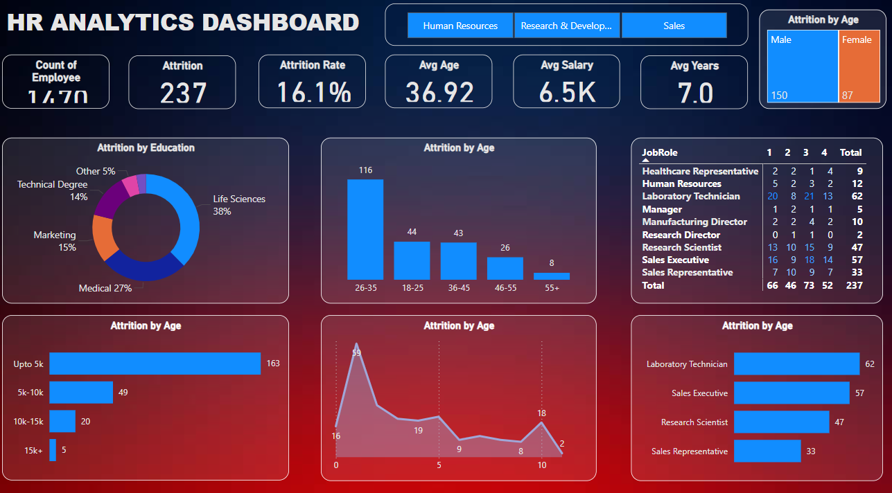

# HR Analytics Dashboard 📊

This Power BI project analyzes employee attrition data to uncover trends based on age, education, gender, job role, and salary.

## 🔍 Dashboard Insights
- **Total Employees**: 1470
- **Attrition Rate**: 16.1%
- **Avg Age**: 36.92 years
- **Avg Salary**: ₹6.5K
- **Key Attrition Factors**: Age group 26–35, roles like Laboratory Technician & Sales Executive

## 📂 Files Included
- `HR_Analytics_Dashboard.pbix`: Power BI report file
- `Screenshot.png`: Dashboard preview
- `hr_data.csv`: (optional) Sample dataset used in the report

## 📷 Dashboard Preview

## 🛠️ Tools Used
- Power BI Desktop
- DAX
- Power Query

## 📌 Purpose
This project aims to assist HR teams in understanding key attrition trends to support better workforce planning.
